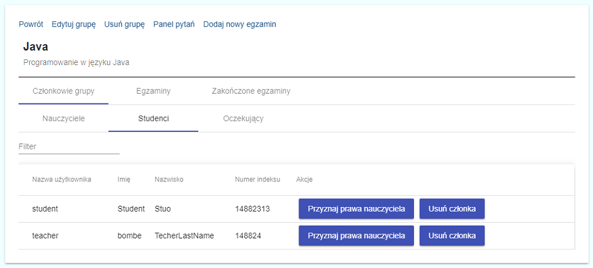
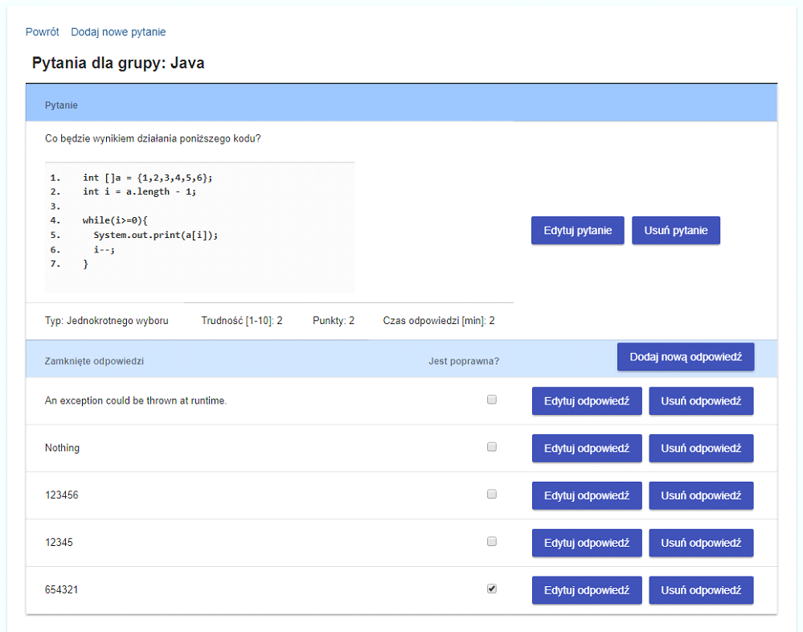
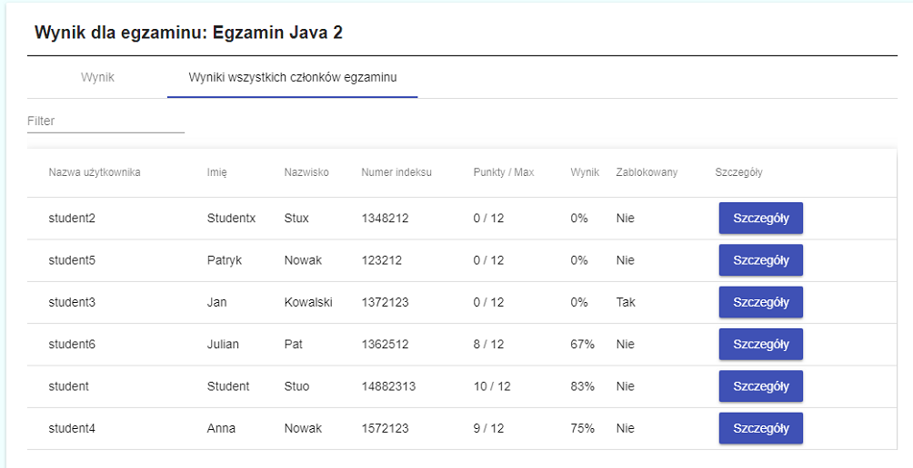
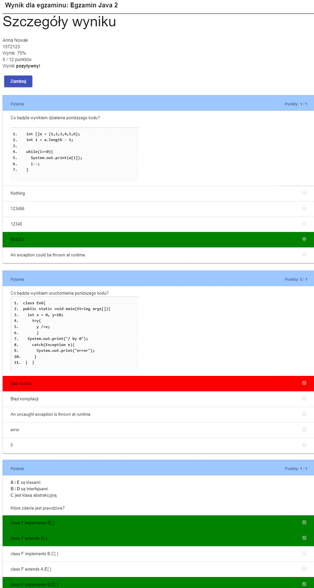

# GoodE

WEB application created for examining students. The application was built using Java, Spring Boot, Hibernate, Angular Framework, Javascript and jQuery. The system allows you to create multiple groups that students can join. Each group can be tested multiple times. Each exam can contain different number of questions. Types of questions: closed, open and multiple choice closed questions.

## Requirements

 - Java 8
 - Angular Framework 7
 - Gradle 5
 - Spring Boot 2
 
 #### Images

 
Img 1. List of students

 
Img 2. Creating questions for the exam

 
Img 3. Exam results for the teacher

 
Img 4. Exam results for the student

